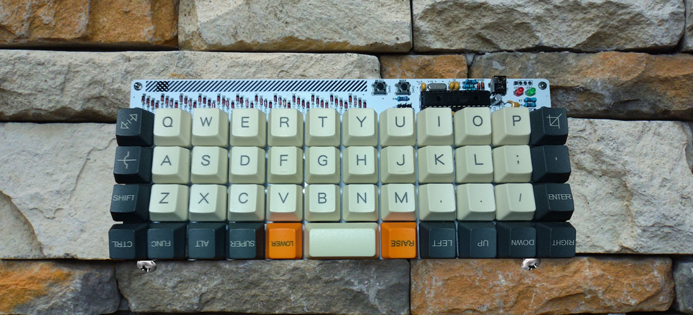
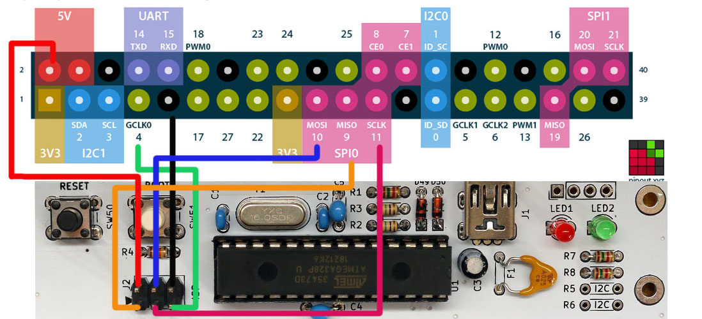

# Raspberry Pi ile Plaid Klavyeye Bootloader Yükleme


RaspberryPi OS yüklü bir raspberry pi cihazının terminaline [PuTTY](https://www.chiark.greenend.org.uk/~sgtatham/putty/latest.html) yardımıyla bağlanın. Dilerseniz aynı işlemleri masaüstü grafik arayüzü bulunan bir RaspberryPi OS sürümünü kullanarak, raspberry pi'ın kendi arayüzü üzerinden de yapabilirsiniz.

### Bağlantı şeması:  
Raspberry pi (RPi 2, 3, 4 veya Zero) ile Plaid arasındaki bağlantıyı aşağıdaki resimde gösterlidiği gibi yapın. 


Raspberry Pi OS güncelleştirmelerini yapın:

```bash
pi@raspberrypi ~ $ sudo apt-get update
```

Flex ve Bison'ı kurun:

```bash
pi@raspberrypi ~ $ sudo apt-get install bison flex -y
```

Avrdude yazılımını yükleyin:

```bash
pi@raspberrypi ~ $ wget http://download.savannah.gnu.org/releases/avrdude/avrdude-6.2.tar.gz
pi@raspberrypi ~ $ tar xfv avrdude-6.2.tar.gz
pi@raspberrypi ~ $ cd avrdude-6.2/
```

linuxgpio'yu etkinlestirin ve yükleyin:

```bash
pi@raspberrypi avrdude-6.2/~ $ ./configure -enable-linuxgpio
pi@raspberrypi avrdude-6.2/~ $ make
pi@raspberrypi avrdude-6.2/~ $ sudo make install

```

Kullanılacak GPIO pinleri için avrdude.conf dosyasını yapılandırın:

```bash
pi@raspberrypi avrdude-6.2/~ $ sudo nano /usr/local/etc/avrdude.conf
```

'linuxgpio' kelimesini aratın, aşağıdaki gibi bir bölüm görmelisiniz:

```bash
#programmer
#  id    = "linuxgpio";
#  desc  = "Use the Linux sysfs interface to bitbang GPIO lines";
#  type  = "linuxgpio";
#  reset = ?;
#  sck   = ?;
#  mosi  = ?;
#  miso  = ?;
#;

```

Bunu şu şekilde değiştirin:

```bash
programmer
  id    = "linuxgpio";
  desc  = "Use the Linux sysfs interface to bitbang GPIO lines";
  type  = "linuxgpio";
  reset = 4;
  sck   = 11;
  mosi  = 10;
  miso  = 9;
;
```


Bootloader için hex dosyasını indirin:  
```bash
pi@raspberrypi avrdude-6.2/~ $ wget https://raw.githubusercontent.com/Daveyr/plaid/add-bootloader-info/bootloader/plaid_default.hex
```

Bootloader'ı yükleyin:

```bash
pi@raspberrypi avrdude-6.2/~ $ sudo avrdude -u -c linuxgpio -p atmega328p -v -U flash:w:"plaid_default.hex":a -U lfuse:w:0xF7:m -U hfuse:w:0xD0:m -U efuse:w:0xfc:m
```

Test etmek için aşağıdaki kodu çalıştırın:
```bash 
sudo avrdude -c linuxgpio -p atmega328p
```
Eğer aşağıdaki çıktıyı alırsanız bootlader başarılı bir şekilde yüklenmiş demektir.🎉

```bash
avrdude.exe: AVR device initialized and ready to accept instructions
Reading | ################################################## | 100% 0.00s
avrdude.exe: Device signature = 0x1e950f (probably m328p)
avrdude.exe done.  Thank you.

```
Yukarıda yüklediğiniz `plaid_default.hex` dosyası firmware ile bootloader'ın birleştirilmiş halidir. Yani bootloader'ı ile beraber firmware'i de yüklediniz. Dolayısıla plaid'in içinde default keymap yüklü şu anda. Plaid'i bilgisayarınıza bağlayıp test edebilirsiniz. Klavye üzerindeki kırmızı led yanmalıdır ve boot düğmesine basmak yeşil led'i yakmalıdır.


Ayrıca Atmega-328p mikro denetleyicisine bootloader'ı yüklendikten sonra qmk kullanarak klavyeyi doğrudan programlayabilirsiniz. Plaid'i bilgisayarınıza usb ile bağlayın, programlama moduna geçmek için:

- Reset butonuna basın.
- Boot butonuna basın.
- Reset butonunu bırakın.
- Boot butonunu bırakın.


Kişiselleştirilmiş keymap dosyalarının nasıl üretildiğini öğrenmek için [https://docs.qmk.fm](https://docs.qmk.fm) adresine bakın.  Klavyeniz için hazırladığınız keymap'i yüklemek için 
[QMK Toolbox](https://github.com/qmk/qmk_toolbox/releases) uygulamasını kullanın veya [qmk_firmware](https://docs.qmk.fm/#/) kullanarak qmk dizininde şu kodu çalıştırın:

```bash
make dm9records/plaid:defaut:flash
```
---

Kaynaklar:

- https://www.algorist.co.uk/post/how-to-burn-the-plaid-keyboard-bootloader-using-arduino-nano/
- https://ozzmaker.com/program-avr-using-raspberry-pi-gpio/


